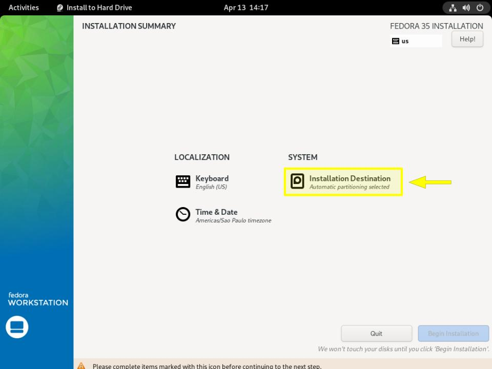
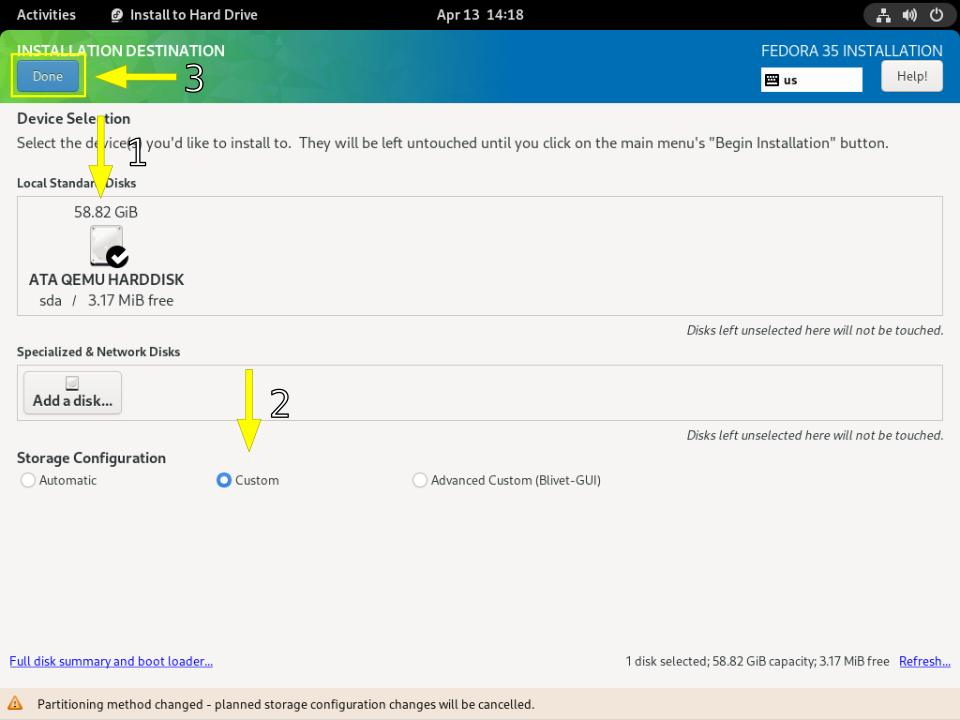
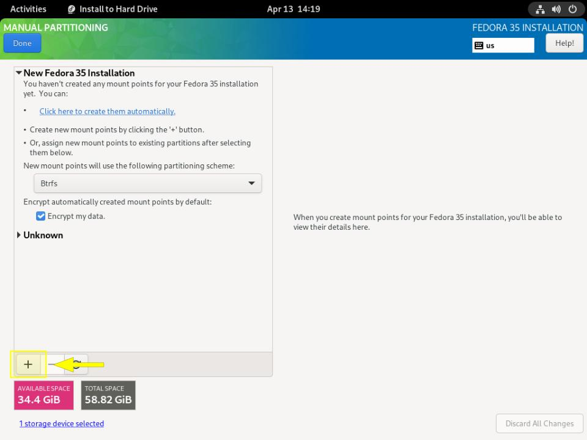
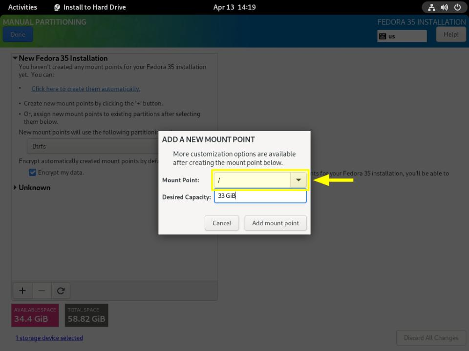
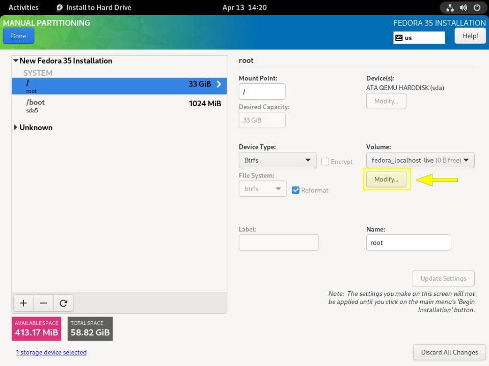
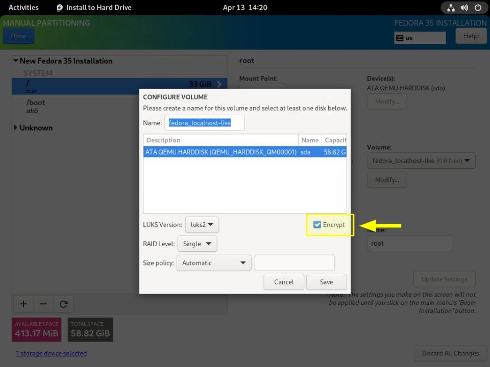
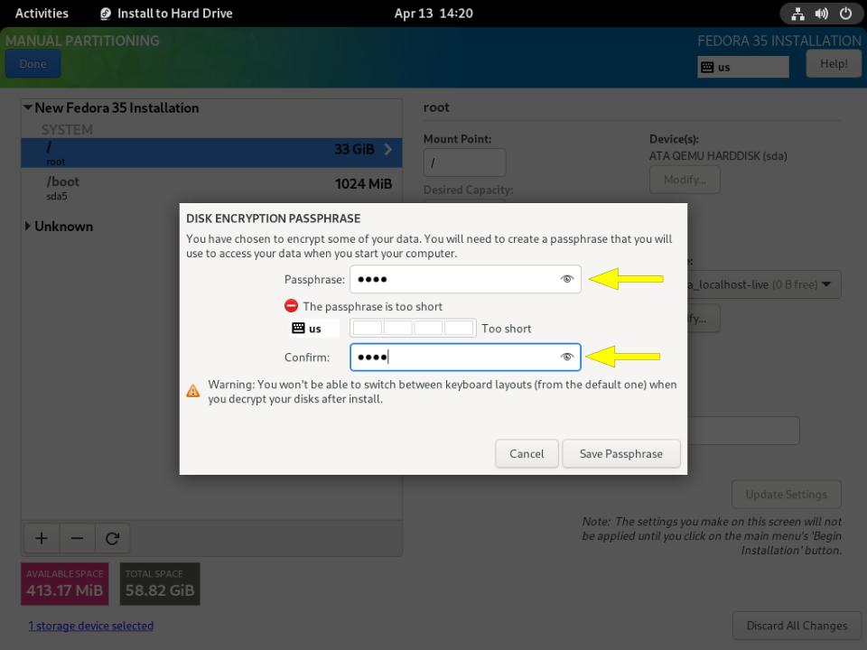

# Instruções para instalação do Fedora com disco criptografado

## Destino da instalação

Dentro do instalador do fedora clique em `Installation Destination`

Em `Local Standand Disks` selecione o disco para a instalação, e em `Storage Configuration` marque a opção `Custom`, clique em `Done` para seguir para o particionamento.

---

## Configuração das partições

Nesse momento é possível usar a opção de particionamento automático do Fedora, para isso, selecione o checkbox `Encrypt my data` e clique em `Click here to create them automatically`. O instalador vai criar as partições, confira se o particionamento está conforme o esperado e clique em `Done`, no canto superior direito, deverá abrir uma janela para inserir a senha de encriptação do disco. Memorize essa senha pois não é possivel recuperar. Com a senha inserida clique em `Save Passphrase`. Ao salvar a senha deverá abrir uma janela com o sumário de mudanças, confira e clique em `Accept Changes`. Após isso é so seguir para a instalação do sistema clicando em `Begin Instalation`, então é só esperar a instalação finalizar e depois reiniciar a máquina.

Caso queira particionar manualmente clique no botão `+` para adicionar uma nova partição ao disco e siga as próximas instruções.

Na opção `Mount Point` selecione `/`, digite o espaço desejado da partição em `Desired Capacity` e clique em `Add mount point`. Após adicionar a partição clique novamente em `+` para acicionar uma partição com `Mount Point '/boot'` insira o tamanho de `1 GiB`.

---

## Encriptação da Partição

Após criar a partição `/boot` selecione a partição `/ (root)` na barra lateral e clique no botão `Modify...`.

Selecione o checkbox `Encrypt` e clique em `Save`.

Após isso clique no botão `Done` no canto superior direito, deverá abrir uma janela para inserir a senha de encriptação do disco. Memorize essa senha pois não é possivel recuperar. Com a senha inserida clique em `Save Passphrase`.

Agora é só seguir com a instalação configurando as opções de `Time/Date` e `Keyboard` e depois clicar em `Begin Instalation`.